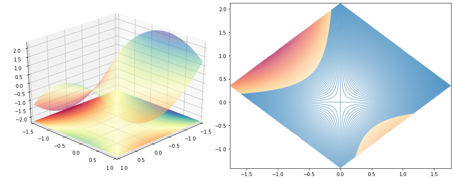

# Optimisations
> This is a small playground where you can experiment with different implementations of optimizers, on different objective functions. 


This project includes utilities to visualize different kinds of plots and animations of how an optimisation performed.

## Install

`pip install optimisations`

## Basic usage

You can pick any of the `Ifunction` definitions and used them with a custom optimizer or a common one found in the `jax` library to see how they function.

```python
from jax.experimental.optimizers import sgd

from optimisations.functions import himmeblau
from optimisations.optimizers import optimize
from optimisations.animations import animate

animate(
    optimize(saddle_point())
        .using(sgd(step_size=0.3))
        .start_from([0.0003, 0.01]),
    frames=50
);
```

    WARNING:absl:No GPU/TPU found, falling back to CPU. (Set TF_CPP_MIN_LOG_LEVEL=0 and rerun for more info.)


    .............................................


    ---------------------------------------------------------------------------

    KeyboardInterrupt                         Traceback (most recent call last)

    ~/Envs/optimisations/lib/python3.6/site-packages/matplotlib/animation.py in saving(self, fig, outfile, dpi, *args, **kwargs)
        229         try:
    --> 230             yield self
        231         finally:


    ~/Envs/optimisations/lib/python3.6/site-packages/matplotlib/animation.py in save(self, filename, writer, fps, dpi, codec, bitrate, extra_args, metadata, extra_anim, savefig_kwargs, progress_callback)
       1147                         # TODO: See if turning off blit is really necessary
    -> 1148                         anim._draw_next_frame(d, blit=False)
       1149                         if progress_callback is not None:


    ~/Envs/optimisations/lib/python3.6/site-packages/matplotlib/animation.py in _draw_next_frame(self, framedata, blit)
       1187         self._pre_draw(framedata, blit)
    -> 1188         self._draw_frame(framedata)
       1189         self._post_draw(framedata, blit)


    ~/Envs/optimisations/lib/python3.6/site-packages/matplotlib/animation.py in _draw_frame(self, framedata)
       1765         # func needs to return a sequence of any artists that were modified.
    -> 1766         self._drawn_artists = self._func(framedata, *self._args)
       1767         if self._blit:


    ~/Applications/GitHub/optimisations/optimisations/animations.py in single_frame(i, optimisations, figure, renderers)
        110 
    --> 111     plot_function(optimisations[0].function, angle=figure.angle, fig=figure.fig, ax_3d=figure.ax_3d, ax_2d=figure.ax_2d, contour_log_scale=figure.contour_log_scale, azimuth_3d=figure.azimuth_3d, zoom_factor=figure.zoom_factor)
        112 


    ~/Applications/GitHub/optimisations/optimisations/graphics.py in plot_function(function, angle, zoom_factor, azimuth_3d, fig, ax_2d, ax_3d, contour_log_scale)
        202     plot_function_3d(function=function, ax=ax_3d, azimuth=azimuth_3d, angle=angle, zoom_factor=zoom_factor, contour_log_scale=contour_log_scale)
    --> 203     plot_function_2d(function=function, ax=ax_2d, angle=angle, zoom_factor=zoom_factor, contour_log_scale=contour_log_scale)
        204 


    ~/Applications/GitHub/optimisations/optimisations/graphics.py in plot_function_2d(function, ax, angle, zoom_factor, contour_log_scale)
        182     contour_color_normalisation = colors.LogNorm(vmin=contour_levels.min(), vmax=contour_levels.max()) if contour_log_scale else colors.Normalize(vmin=zz.min(), vmax=zz.max())
    --> 183     ax.contour(xx, yy, zz, levels=contour_levels, cmap='Spectral', norm=contour_color_normalisation, alpha=0.5)
        184 


    ~/Envs/optimisations/lib/python3.6/site-packages/matplotlib/__init__.py in inner(ax, data, *args, **kwargs)
       1564         if data is None:
    -> 1565             return func(ax, *map(sanitize_sequence, args), **kwargs)
       1566 


    ~/Envs/optimisations/lib/python3.6/site-packages/matplotlib/axes/_axes.py in contour(self, *args, **kwargs)
       6336         kwargs['filled'] = False
    -> 6337         contours = mcontour.QuadContourSet(self, *args, **kwargs)
       6338         self._request_autoscale_view()


    ~/Envs/optimisations/lib/python3.6/site-packages/matplotlib/contour.py in __init__(self, ax, levels, filled, linewidths, linestyles, alpha, origin, extent, cmap, colors, norm, vmin, vmax, extend, antialiased, *args, **kwargs)
        929 
    --> 930         self.changed()  # set the colors
        931 


    ~/Envs/optimisations/lib/python3.6/site-packages/matplotlib/contour.py in changed(self)
       1095             else:
    -> 1096                 collection.set_color(color)
       1097         for label, cv in zip(self.labelTexts, self.labelCValues):


    ~/Envs/optimisations/lib/python3.6/site-packages/matplotlib/collections.py in set_color(self, c)
       1420         """
    -> 1421         self.set_edgecolor(c)
       1422         self.stale = True


    ~/Envs/optimisations/lib/python3.6/site-packages/matplotlib/collections.py in set_edgecolor(self, c)
        766         self._original_edgecolor = c
    --> 767         self._set_edgecolor(c)
        768 


    ~/Envs/optimisations/lib/python3.6/site-packages/matplotlib/collections.py in _set_edgecolor(self, c)
        753             self._hatch_color = tuple(self._edgecolors[0])
    --> 754         self.stale = True
        755 


    ~/Envs/optimisations/lib/python3.6/site-packages/matplotlib/artist.py in stale(self, val)
        223         # draw loop (when not saving) so do not propagate this change
    --> 224         if self.get_animated():
        225             return


    ~/Envs/optimisations/lib/python3.6/site-packages/matplotlib/artist.py in get_animated(self)
        803 
    --> 804     def get_animated(self):
        805         """Return the animated state."""


    KeyboardInterrupt: 

    
    During handling of the above exception, another exception occurred:


    CalledProcessError                        Traceback (most recent call last)

    <ipython-input-3-24faa0ed2d14> in <module>
          9         .using(sgd(step_size=0.3))
         10         .start_from([0.0003, 0.01]),
    ---> 11     frames=100
         12 );


    ~/Applications/GitHub/optimisations/optimisations/animations.py in animate(optimisations, figure, renderers, frames, interval, output)
        152 
        153     if output == 'mp4':
    --> 154         video = animator.to_html5_video()
        155     elif output == 'js':
        156         video = animator.to_jshtml()


    ~/Envs/optimisations/lib/python3.6/site-packages/matplotlib/animation.py in to_html5_video(self, embed_limit)
       1330                                 bitrate=rcParams['animation.bitrate'],
       1331                                 fps=1000. / self._interval)
    -> 1332                 self.save(str(path), writer=writer)
       1333                 # Now open and base64 encode.
       1334                 vid64 = base64.encodebytes(path.read_bytes())


    ~/Envs/optimisations/lib/python3.6/site-packages/matplotlib/animation.py in save(self, filename, writer, fps, dpi, codec, bitrate, extra_args, metadata, extra_anim, savefig_kwargs, progress_callback)
       1150                             progress_callback(frame_number, total_frames)
       1151                             frame_number += 1
    -> 1152                     writer.grab_frame(**savefig_kwargs)
       1153 
       1154         # Reconnect signal for first draw if necessary


    ~/.pyenv/versions/3.6.5/lib/python3.6/contextlib.py in __exit__(self, type, value, traceback)
         97                 value = type()
         98             try:
    ---> 99                 self.gen.throw(type, value, traceback)
        100             except StopIteration as exc:
        101                 # Suppress StopIteration *unless* it's the same exception that


    ~/Envs/optimisations/lib/python3.6/site-packages/matplotlib/animation.py in saving(self, fig, outfile, dpi, *args, **kwargs)
        230             yield self
        231         finally:
    --> 232             self.finish()
        233 
        234 


    ~/Envs/optimisations/lib/python3.6/site-packages/matplotlib/animation.py in finish(self)
        366     def finish(self):
        367         '''Finish any processing for writing the movie.'''
    --> 368         self.cleanup()
        369 
        370     def grab_frame(self, **savefig_kwargs):


    ~/Envs/optimisations/lib/python3.6/site-packages/matplotlib/animation.py in cleanup(self)
        410         if self._proc.returncode:
        411             raise subprocess.CalledProcessError(
    --> 412                 self._proc.returncode, self._proc.args, out, err)
        413 
        414     @classmethod


    CalledProcessError: Command '['ffmpeg', '-f', 'rawvideo', '-vcodec', 'rawvideo', '-s', '936x360', '-pix_fmt', 'rgba', '-r', '20.0', '-loglevel', 'error', '-i', 'pipe:', '-vcodec', 'h264', '-pix_fmt', 'yuv420p', '-y', '/var/folders/z4/y57gmn1j039gx92f6zrdncx40000gn/T/tmpn8rtd09c/temp.m4v']' returned non-zero exit status 255.




