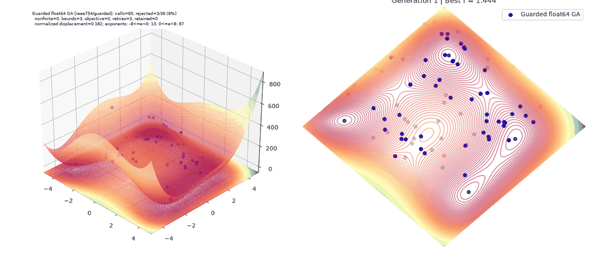

# Optimisations


<!-- WARNING: THIS FILE WAS AUTOGENERATED! DO NOT EDIT! -->


Visualise 2D objective functions and compare the paths taken by JAX optimisers.

## Basic usage

Use an objective function from `optimisations.functions` with an optimizer triple from `jax.example_libraries.optimizers`. The example library provides convenient triples for experimenting (for production training, JAX recommends Optax). In Jupyter, `animate` displays the result and returns the generated HTML; use `output='js'` to avoid ffmpeg.

``` python
from jax.example_libraries.optimizers import sgd

from optimisations.functions import himmelblau
from optimisations.optimizers import optimize
from optimisations.animations import animate

animate(
    optimize(himmelblau())
        .using(sgd(step_size=0.01))
        .start_from([0.0003, 0.01]),
    frames=20,
    output='js'
);
```

## Derivatives free optimisations



```python
from optimisations.functions import himmelblau
from optimisations.genetic import genetic_algo
from optimisations.optimizers import optimize
from optimisations.animations import animate

animate(
    optimize(himmelblau())
        .using(
            genetic_algo(
                encoding='ieee754', 
                operators='guarded',
                mutation_chance=0.48 / 128, 
                seed=7,
            ),
            derivatives_based=False,
        )
        .start_from([-1.0, 1.0]),
    frames=80,
    interval=100,
    output='js',
    show_diagnostics=True,
)
```

The library also allows to illustrate the optimisation process for other derivatives free optimisers, such as a genetic algorithm.

## Install

Clone this repository and use `pip install -e .`. 
For MP4 animations, install the `ffmpeg` executable separately; `output='js'` does not need it.

## Documentation 

Full documentation is available at [https://clungu.github.io/optimisations](https://clungu.github.io/optimisations).

## Development
From a checkout, use Python 3.10 or newer:

``` sh
python -m venv .venv
. .venv/bin/activate
python -m pip install -e '.[dev]'
```
