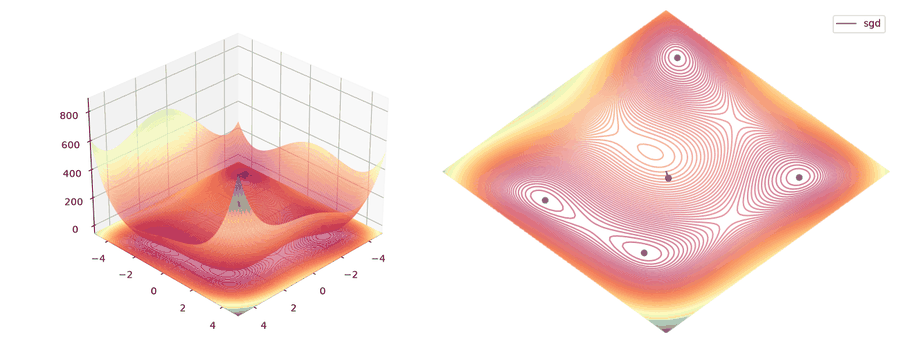

# Optimisations


<!-- WARNING: THIS FILE WAS AUTOGENERATED! DO NOT EDIT! -->

Visualise 2D objective functions and compare the paths taken by JAX optimisers. Notebooks `00_functions.ipynb` through `05_animations.ipynb` are the source for the installable `optimisations` package.

## Install

From a checkout, use Python 3.10 or newer:

``` sh
python -m venv .venv
. .venv/bin/activate
python -m pip install -e '.[dev]'
```

Use `pip install .` if you only need the package. For MP4 animations, install the `ffmpeg` executable separately; `output='js'` does not need it.

## Basic usage

Use an objective function from `optimisations.functions` with an optimizer triple from `jax.example_libraries.optimizers`. The example library provides convenient triples for experimenting (for production training, JAX recommends Optax). In Jupyter, [`animate`](https://clungu.github.io/optimisations/animations.html#animate) displays the result and returns the generated HTML; use `output='js'` to avoid ffmpeg.

``` python
from jax.example_libraries.optimizers import sgd

from optimisations.functions import himmelblau
from optimisations.optimizers import optimize
from optimisations.animations import animate

animate(
    optimize(himmelblau())
        .using(sgd(step_size=0.01))
        .start_from([0.0003, 0.01]),
    frames=20,
    output='js'
);
```

### Animation preview

GitHub does not run JavaScript embedded in a README, so this GIF previews the same optimisation run. Run `./demo.sh` and open `output/README-example.html` locally to use the playback controls.


